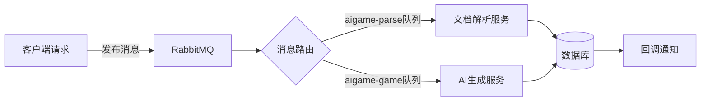
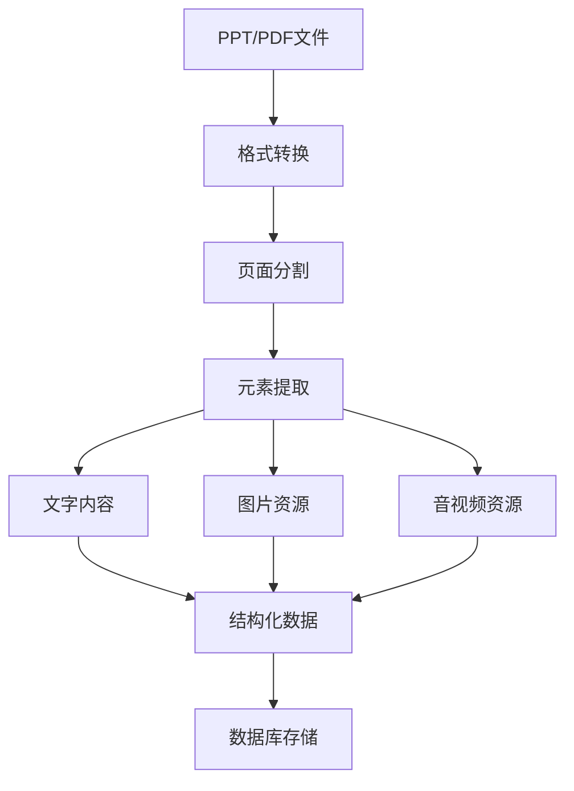
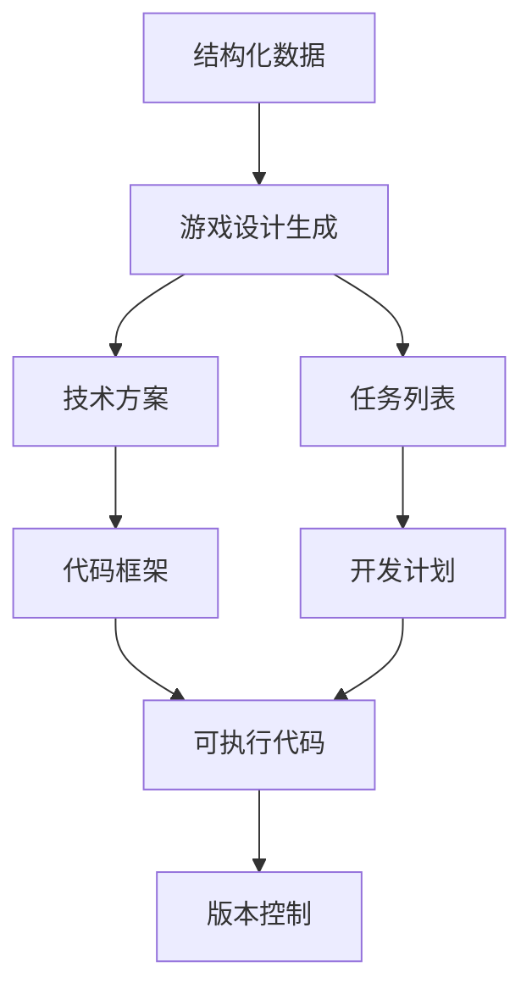

# AI Game Development Tools

一套用于游戏开发的AI辅助工具集，支持从设计文档到可执行代码的自动化转换流程。

## 核心功能

1. **文档解析与转换**
   - PPT/PDF文档解析（提取文字、图片、音视频等元素）
   - 文档格式转换（PPT→PDF→图片等）
   - 结构化数据提取

2. **AI辅助设计**
   - 游戏设计文档生成
   - 任务分解与分配
   - 技术方案设计

3. **多媒体处理**
   - 语音合成(TTS)与情感控制
   - 音频/视频标签生成
   - 多语言支持

4. **代码生成**
   - 根据设计文档自动生成游戏代码框架
   - 资源文件管理

## 技术架构


### 文档解析服务详细流程

关键处理步骤：

1. 格式转换 ：使用 doc_convert 将PPT转为PDF
2. 页面分割 ：通过 pdf2image 分割为单页图片
3. 元素提取 ：
   - 文字：提取标题、正文、注释
   - 图片：保存原始文件并生成缩略图
   - 媒体：提取嵌入的音视频资源
4. 结构化存储 ：将提取结果按幻灯片页面组织并存入数据库
### AI生成服务详细流程


## 游戏设计生成Pipe ：
   - 使用Onlyoffice将PPT转为PDF和图片（暂未用到）
   - 解析PPT，提取内容和结构信息
   - 对PPT中图片和音频使用TagAgent进行标签生成，最后保存到parse.json中
   - 使用parse.json 调用ChatGPT生成游戏目标goal.json
   - 使用goal.json 调用ChatGPT生成游戏设计文档(design.json-> 各模块的plans.json)
   - 拆分各游戏模块，保存到各模块的plan.json中
   - 使用plan.json调用code_agent的create_asset(已经封装了tts和image_generate到mcp中)方法，生成素材资源
   - 使用plan.json和asset.json调用code_agent的create_code方法，生成代码并保存项目到本地
    

## 安装与使用
### Requirements
- RabbitMQ
- onlyoffice
- rye

```
rye run app
```
* License: None
